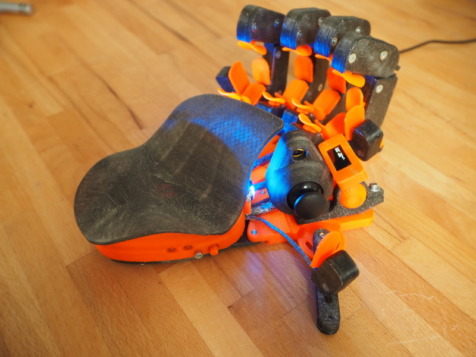
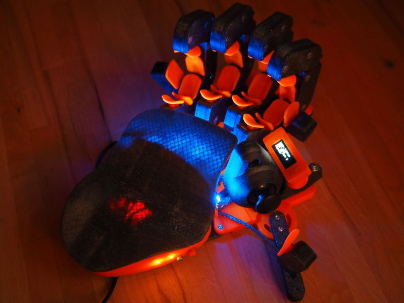
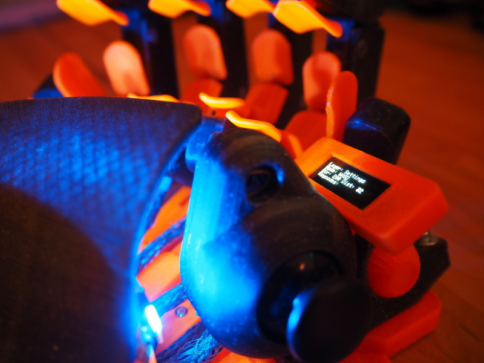
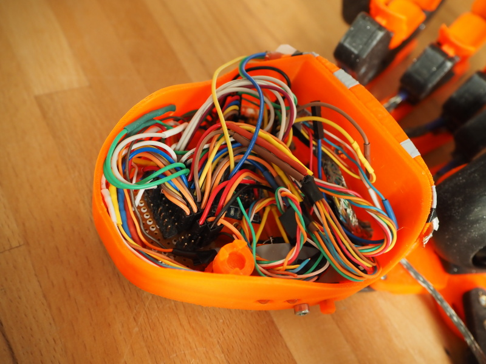
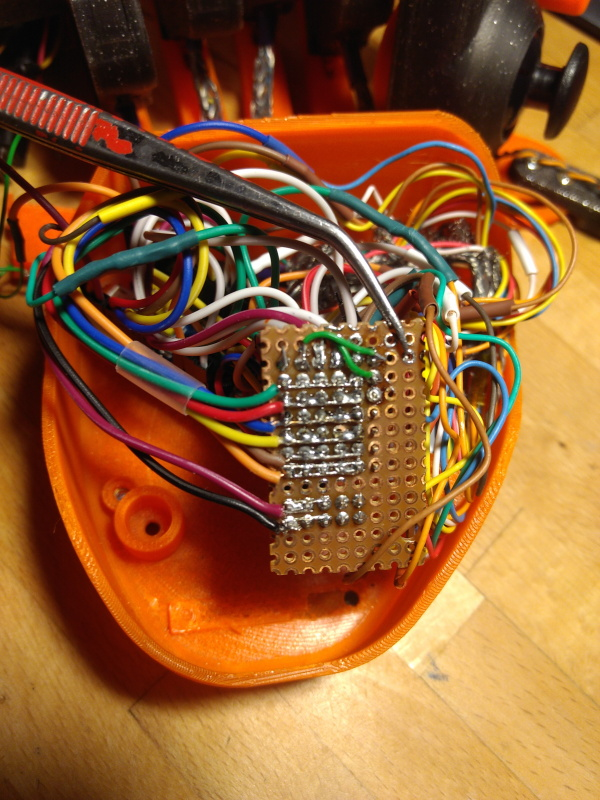
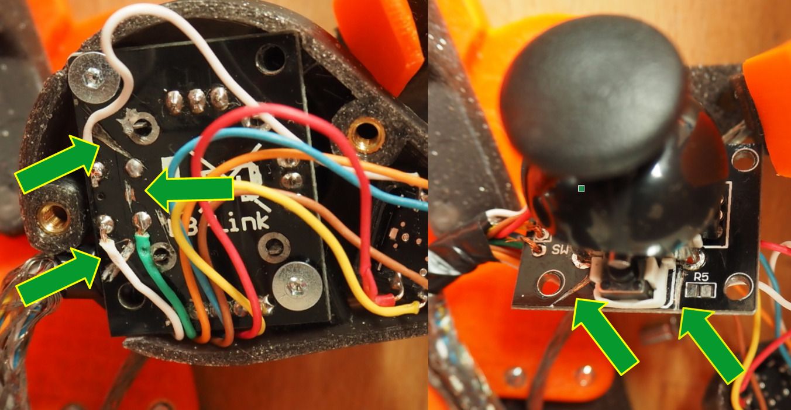

# Replicazeron FreeCAD

modified parts for QMK powered replicazeron build with STM32F103



This repo only contains complementary parts to this project:

[DIY Azeron](https://sites.google.com/view/alvaro-rosati/azeron-keypad-diy-tutorial)

## Features

 * 23 keys
 * analog stick with WASD emulation
 * 5-way dpad
 * OLED display displaying status info and basic configuration
 * 2 status LEDS
 * 6x WS2812 RGB-LED lighting
 * layout editing and oled control from PC using [via](https://www.caniusevia.com/) without the need to reflash the firmware

## BOM

### tldr BOM

In addition to the BOM required for the DYI Azeron & the modified printable [STLs](https://github.com/9R/replicazeron/tree/main/STLs) from this repo you will need the following parts.

The listed parts are only what I used to build the Replicazeron. With minor changes to the configuration a build should be possible with any other MCU & display that is supported by QMK.

|part                        | function                     | quantity    |
|----------------------------|------------------------------|-------------|
| STM32F103 dev board        | MCU                          |           1 |
| ssd1306 128x32             | display                      |           1 |
| WS2812 (on strip)          | addressable LEDs             |           6 |
| M3x10 ISO4762 "cheesehead" | display * LED attachment     |           2 |
| 1N4148 diodes              | switch matrix diodes         |          30 |
| leftover ethernetwire      | wireing & liner              |         <2m |
| bit of bread board         |                              | ~8x13 holes |
| 2.56mm pitch pin headers   |                              |         ~50 |
| dupond jumper wires        |                              |         ~25 |
| some shrink tube           |                              |             |

### MCU
Recommended MCU is an STM32F103 on a bluepill dev board.

A build is also possible with an ATmega32 promicro, but this dev board does not have enough GPIOs to attach a LED strip.

### Display
This build uses a **ssd1306** OLED with 128x32 pixels. The 128x64 pixel version of the ssd1306 should also work but would need a modified housing.

### Adressable LED strip
For optional lighting an addressable WS2612 LED-strip with 6 LEDs is used.

### Wires
I used a bit of old network cable to get some easily distinguishable wires. Bonus: The shielding can be used as a nice looking liner to route the cables from the fingers to the base.

To connect the wireing to the MCU I used 2.56mm pitch dupond wires, pin headers and a bit of bread board.

For the switch matrix to work you will also need 30 signal diodes (i.e. 1N4148).

### Fastener(s)
In addition to the fasteners required for the DIY Azeron you will need one M3x10 screw to attach the display

## Prepare devboard

This step is only required once.

### STM32F103 bluepill

Install the stm32duino bootloader [from this repo](https://github.com/rogerclarkmelbourne/STM32duino-bootloader). The correct prebuild binary for a stm bluepill is `binaries/generic_boot20_pc13.bin`

Flash the bootloader with [stlink](https://github.com/stlink-org/stlink).

### ProMicro (atmega32)

Install caterina bootloader on you promicro

## HowTo: Build & flash QMK

 - clone firmware
   ```bash
   git clone https://github.com/9R/qmk_firmware
   ```

 - setup qmk environment via package management or in python venv
   ```bash
   python -m venv venv
   source venv/bin/activate # you'll need to repeat this after leaving the venv. the other steps only need to be executed once
   pip install qmk
   ```

 - Set qmk defaults
   ```bash
   #set default keyboard:
   qmk config user.keyboard=handwired/replicazeron

   #if you are using a promicro specify the variant:
   qmk config user.keyboard=handwired/replicazeron/promicro

   #set default keymap:
   qmk config user.keymap=via
   ```

 - Build firmware
   ```bash
   cd qmk-firmware

   qmk compile
   ```

 - First time flash firmware with ```dfu-util```
   ```bash
   dfu-util -a 2 -d 1EAF:0003 -D .build/handwired_replicazeron_stm32_via.bin
   ```

 - After qmk is running on the controller, build and flash in one go with
   ```bash
   # pressing the pinky button second closesed to the palm on the settings layer in default mapping will activate reboot to lash mode
   qmk flash
   ```
 
## Related repos

[replicazeron qmk-firmware fork](https://github.com/9R/qmk_firmware)

[replicazeron via-keyboards fork](https://github.com/9R/keyboards)

[replicazeron STM32F103 bluepill schematics](https://github.com/9R/replicazeron_schematics)

## Pictures






## Wireing

Use the [schematics](https://raw.githubusercontent.com/9R/replicazeron_schematics/main/replicazeron_sch.pdf) as reference.

Columns 1 to 4 are the finger towers, the last column attaches the 5way dpad.

Rows 1 to 5 are wired to button 1 to 5 on each finger.

The sixth row is used to connect "special" keys like side keys, analog click and base key.





### Thumbstick click
To read the thumbstick press via the key matrix you will have to cut some traces on the analog stick pcb and solder the colmn & row wires directly to the button pins.



